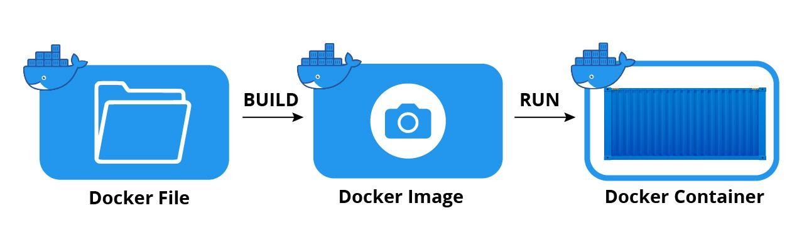
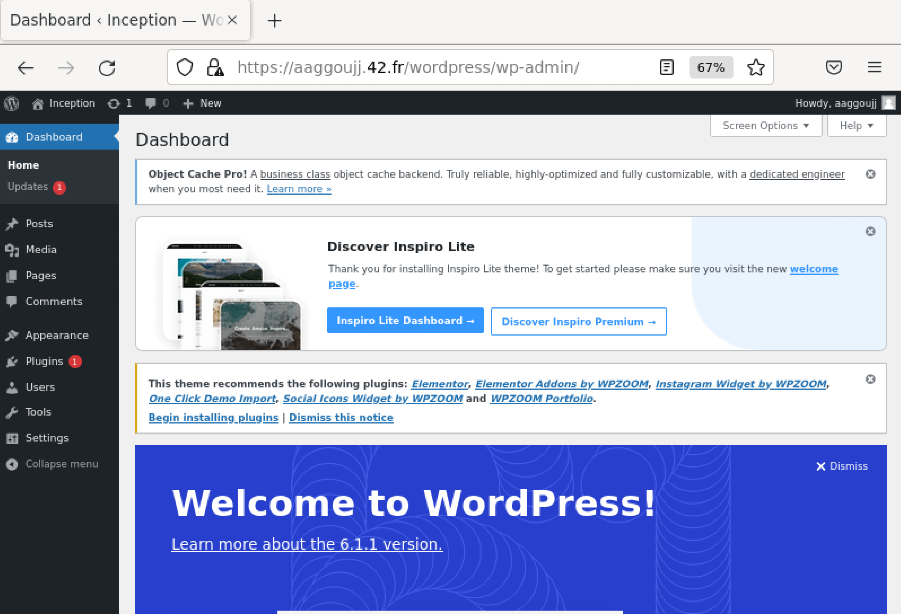
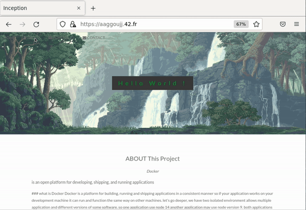
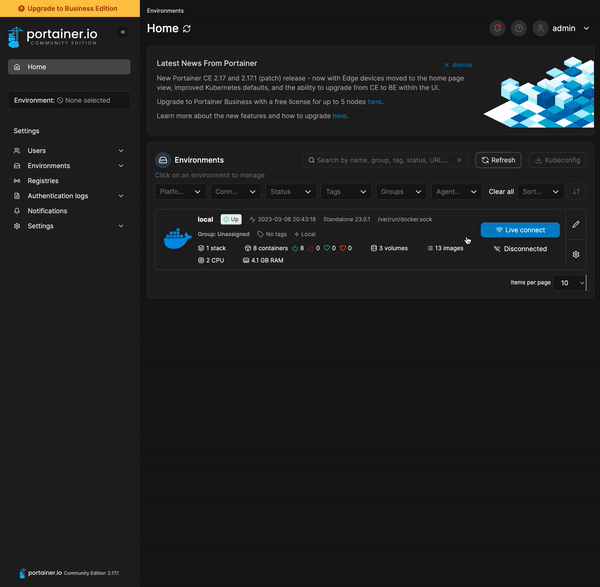
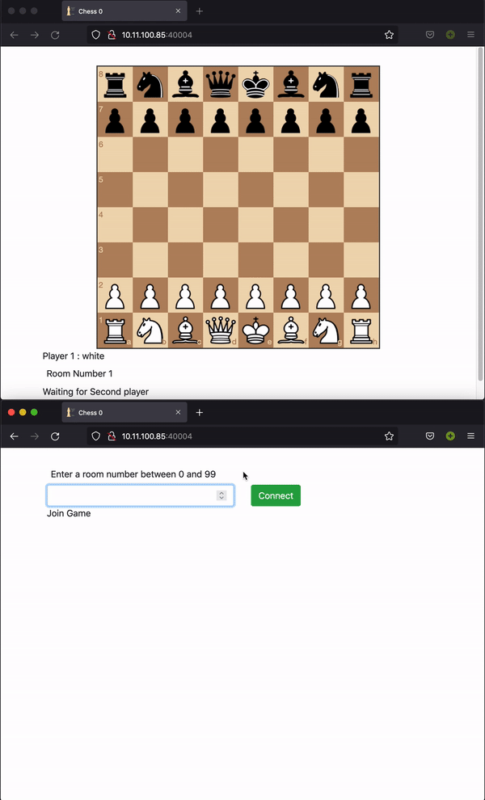

# Inception_42
This **project** is an introduction to Docker. It aims at setting up multiple services using Docker containers.
<br>
<br>
<h3>What is Docker</h3>


[Docker](https://docs.docker.com/get-started/) is a software platform designed to help developers build, share, and run modern applications. It allows you to package your application and its dependencies into a standardized unit called a container, which can be easily shared and run on any machine that has Docker installed.

<br>
<h3>What is Containers : </h3>

A [container](https://docs.docker.com/get-started/02_our_app/) is a lightweight, standalone, executable package of software that includes everything needed to run an application. It consists of an entire runtime environment, including the application code, runtime, system tools, libraries, and settings. Containers are isolated from each other and from the host system, which makes them portable and easy to deploy across different environments.

<br><hr>
<h3>Different between container and VM </h3>

The primary difference between containers and virtual machines is that containers provide a way to virtualize an OS so that the same code can run on any device, while virtual machines virtualize an entire machine down to the hardware layers. Containers are small, fast, and portable because they do not need to include a guest OS in every instance, while virtual machines require a full copy of the operating system for each instance.
#### Downside of VMs

- Each vm needs a. full-blown OS
- Slow to start
- Resource intensive

#### Advantages of Containers

- Allow running multiple apps in isolation
- are lightweight process
- use OS of the host
- Start quickly
- Need less hardware resources


<h3>Docker images</h3>

A Docker image is a read-only template that contains a set of instructions for creating a container that can run on the Docker platform. It provides a convenient way to package up applications and preconfigured server environments, which you can use for your own private use or share publicly with other Docker users.A Docker image includes everything needed to run an application, such as the application code, runtime, system tools, libraries, and settings.



Additional ressources:<br>
[Docker in 100 seconds](https://www.youtube.com/watch?v=Gjnup-PuquQ).<br>
[Docker docs](https://docs.docker.com/).

### Important commands to use docker
<hr>
General docker commands:
<br>

```sh
docker ps # Show currently running containers

docker pull "NameOfTheImage" # pull an image from dockerhub.

docker rm <container_name> # Delete docker containers.

docker exec -it <container_name> "command" "arg1" "arg2" ... # Execute command in the container.

docker run <image_name> # Run the docker image
```
<hr>

### What's Dockerfile<br>
A Dockerfile is a text document that contains all the commands a user could call on the command line to assemble an image.
<br><br>

#### Example of Dockerfile
<br>

```Dockerfile
FROM debian:buster # Base image
WORKDIR /app 
COPY src dest
RUN yarn install --production
CMD ["node", "src/index.js"]
EXPOSE 3000
```
<hr><br>

<h3><li> What Docker Compose solves ?</li></h3>

<br>

First, Docker Compose is a tool for defining and running multi-container Docker applications. It allows you to define the services that make up your application in a YAML file, which can then be used to start and stop all the containers at once.<br><br>
The main difference between Docker and Docker Compose is that Docker is used to build, run, and manage individual containers, while Docker Compose is used to define and run multi-container applications.

### Example of docker-compose.yml :
<br>

```yml
version: "3.9"
services:
  web:
    build: . # Dockerfile Path
    ports:
      - "8000:5000"
  redis:
    image: "redis:alpine"
```
<hr><br>

## Docker Network
<hr>

*Docker networking* enables a user to link a Docker container to as many networks as he/she requires. Docker Networks are used to provide complete isolation for Docker containers.

Note: A user can add containers to more than one network.

Let’s move forward and look at the Advantages of networkin
<hr>

<div style="display: table;">
  <div style="display: table-cell; vertical-align: middle;">
    
  </div>
  <div style="display: table-cell; vertical-align: middle;">
    <h2>NGNIX</h2>
  </div>
</div>

* [NGINX](https://www.youtube.com/watch?v=JKxlsvZXG7c)  is open source software for web serving, reverse proxying, caching, load balancing, media streaming.
<br>
<details>
<summary>
What is Deamon ?
</summary>
<hr>
In multitasking computer operating systems, a daemon is a computer program that runs as a background process, rather than being under the direct control of the user. It is typically started at boot time and runs continuously, waiting for requests to perform certain tasks or services. Daemons are often used to provide network services such as web servers, email servers, and file servers
<hr>
</details>
<br>

For Dockerfile

```Dockerfile
FROM 	alpine:3.16.4

COPY 	./conf/nginx.conf /etc/nginx/nginx.conf

COPY 	./tools/script.sh /

RUN     sh ../script.sh

EXPOSE 	443 
CMD 	["nginx", "-g", "daemon off;"]
```

in script i configurate Secure Sockets Layer or [SSL](https://www.cloudflare.com/learning/ssl/what-is-ssl/), and the configuration of nginx i set up in nginx.conf file here i [Full Example Configuration](https://www.nginx.com/resources/wiki/start/topics/examples/full/) of them.

For configurate SSL we need to download `openssl` in your OS. but  you have to know what's [HTTP](https://www.cloudflare.com/learning/ddos/glossary/hypertext-transfer-protocol-http/), [HTTPS](https://www.cloudflare.com/learning/ssl/what-is-https/) and what is an [SSL Certificate](https://www.cloudflare.com/learning/ssl/what-is-an-ssl-certificate/)?

You can create a self-signed key and certificate pair with OpenSSL in a single command:
```sh
sudo openssl req -x509 -nodes -days 365 -newkey rsa:2048 -keyout /etc/ssl/private/nginx-selfsigned.key -out /etc/ssl/certs/nginx-selfsigned.crt
```

<details>
<summary>Command explining Here</summary>
<hr>

-`openssl`: This is the basic command line tool for creating and managing OpenSSL certificates, keys, and other files.<br>
-`req`: This subcommand specifies that we want to use X.509 certificate signing request (CSR) management. The “X.509” is a public key infrastructure standard that SSL and TLS adheres to for its key and certificate management. We want to create a new X.509 cert, so we are using this subcommand.<br>
-`x509`: This further modifies the previous subcommand by telling the utility that we want to make a self-signed certificate instead of generating a certificate signing request, as would normally happen.<br>
-`nodes`: This tells OpenSSL to skip the option to secure our certificate with a passphrase. We need Nginx to be able to read the file, without user intervention, when the server starts up. A passphrase would prevent this from happening because we would have to enter it after every restart.<br>
-`days 365`: This option sets the length of time that the certificate will be considered valid. We set it for one year here.<br>
-`newkey rsa:2048`: This specifies that we want to generate a new certificate and a new key at the same time. We did not create the key that is required to sign the certificate in a previous step, so we need to create it along with the certificate. The rsa:2048 portion tells it to make an RSA key that is 2048 bits long.<br>
-`keyout`: This line tells OpenSSL where to place the generated private key file that we are creating.<br>
-`out`: This tells OpenSSL where to place the certificate that we are creating.

<hr>
</details>

<hr><br>

<div style="display: table;">
  <div style="display: table-cell; vertical-align: middle;">
    
  </div>
  <div style="display: table-cell; vertical-align: middle;">
    <h2>Mariadb</h2>
  </div>
</div>

<details>
<summary>What is mariadb</summary>
<br>
The MariaDB and MySQL database management systems
 have a lot in common, which can make it difficult to choose when you need to decide on a database solution for your business. Both systems are fundamentally open source, relational databases
. MariaDB is originally a spin-off or further development of the MySQL project, which is now fully managed by Oracle. Because Oracle holds the trademark rights to the name MySQL as of 2010, a new name for this database project was found in MariaDB.
</details>
<br>
<details>
<summary>What different between mysql and mariadb</summary>
<hr>

*MySQL* offers a free open source community edition. However, if you need enterprise-level features, MySQL locks some of those features behind proprietary code. So for the full version of MySQL, companies must purchase an Enterprise Edition.

*MariaDB* offers all of its features in its open source package. Users can still pay for support services or for cloud implementations (enterprise licence), but a qualified team can use the best and core features of MariaDB completely free of charge.

Apart from how these two products handle their open source code base, MySQL and MariaDB also have other different salient features.
<hr>
</details>

```Dockerfile
FROM alpine:3.16.4

RUN apk add --no-cache mariadb mariadb-client

COPY ./tools/script.sh /tmp/script.sh
COPY ./conf/my.cnf /etc/my.cnf

ENTRYPOINT [ "sh","/tmp/script.sh" ]
```

in config file my.cnf i set two configuration for `mysqld` i set `datadir = /var/lib/mysql`
and i have to bind address for anyone `bind-address = 0.0.0.0` in `galera` like this 
```cnf
[mysqld]
datadir=/var/lib/mysql
[galera]
bind-address=0.0.0.0
```

next step is run this command  `mysql_install_db --user=mysql --datadir=/var/lib/mysql --skip-test-db` its will install all dependance of mysql and skip test database.

Testing Mariadb with Following command
```sh
$> mariadb
...
MariaDB [(none)]> CREATE DATABASE IF NOT EXISTS usertest;
Query OK, 1 row affected (0.000 sec
MariaDB [(none)]> GRANT ALL PRIVILEGES ON usertest.* TO 'usertest'@'%' IDENTIFIED BY 'userpassword';
Query OK, 0 rows affected (0.002 sec)
MariaDB [(none)]> SHOW DATABASES;
+--------------------+
| Database           |
+--------------------+
| usertest           |
| information_schema |
| mysql              |
| performance_schema |
| sys                |
+--------------------+
5 rows in set (0.000 sec)
$>
```
<br>
<hr>

<div style="display: table;">
  <div style="display: table-cell; vertical-align: middle;">
    
  </div>
  <div style="display: table-cell; vertical-align: middle;">
    <h2>WordPress</h2>
  </div>
</div>


<details>
<summary>What is wordpress</summary>
WordPress is an open-source content management system (CMS) software used to build, modify, and maintain websites[1][2]. It is a popular CMS that is used for a wide variety of websites, from personal blogs to large e-commerce sites.
</details>

For Install Wordpress you can use [wp cli](https://wp-cli.org/) you might perform in the WordPress admin

```sh
wp core download --allow-root # Downloads core WordPress files.
wp config create              # Generates a wp-config.php file. with flag --dbname, --dbuser...
wp core install               # Runs the standard WordPress installation process.
```

#### Dockerfile of wordpress

```Dockerfile
FROM alpine:3.16.4

# edit version of repositories in apk for download all dependences of php7
RUN sed -i "s/6/5/g" /etc/apk/repositories

RUN apk add --no-cache curl php7 php7-phar php7-tokenizer \
      php7-common mariadb-client php7-session php7-iconv \
        php7-json php7-gd php7-curl php7-xml php7-mysqli 

# install wp cli 
RUN curl -O "https://raw.githubusercontent.com/wp-cli/builds/gh-pages/phar/wp-cli.phar" \
	&& chmod +x wp-cli.phar \
	&& mv wp-cli.phar /usr/local/bin/wp

# creat system user
RUN adduser -S nginx && addgroup -S nginx

# configuration of php7
COPY ./conf/php-fpm.conf /etc/php7/

COPY ./tools/script.sh /tmp


ENTRYPOINT [ "sh","/tmp/script.sh"]

```

in scripte you will Downloads core WordPress file and generated wp-config file using `wp` command
and run `php-fpm7 -F` for runing php fastcgi process manager and force to stay in foreground and ignore daemonize option from  configuration file.

page of wordpress example:


You can enter to admin page using path of wp-admin directory for example
https://login.42.fr/wordpress/wp-admin



<hr>
<div style="display: table;">
  <div style="display: table-cell; vertical-align: middle;">
    
  </div>
  <div style="display: table-cell; vertical-align: middle;">
    <h2>Redis</h2>
  </div>
</div>


**Redis Cache** is an in-memory data store that can be used as a database, cache, streaming engine, and message broker. It provides an in-memory data store based on the Redis software and delivers sub-millisecond response times. Redis Cache is often used to speed up website page load time for users and improve the performance and scalability of applications that use backend data stores heavily.


for install plugin redis-cache using `wp plugin install redis-cache --activate --allow-root`
and for config redis you can set this configuration 
```sh
	wp config set "WP_REDIS_HOST" redis --allow-root
	wp config set "WP_REDIS_PORT" 6379 --raw --allow-root
	#reasonable connection and read + write
	wp config set "WP_REDIS_TIMEOUT" 1 --raw --allow-root
	wp config set "WP_REDIS_READ_TIMEOUT" 1 --raw --allow-root
	wp config set "WP_REDIS_DATABASE" 0 --raw --allow-root
```
you can find all rescources [HERE](https://github.com/rhubarbgroup/redis-cache/#config).

<hr>
<br>


<div style="display: table;">
  <div style="display: table-cell; vertical-align: middle;">
    
  </div>
  <div style="display: table-cell; vertical-align: middle;">
    <h2>Adminer</h2>
  </div>
</div>


Adminer is a free, open-source, web-based database management tool written in PHP. It is a full-featured database management system that allows users to manage databases easily. Adminer consists of a single file ready to deploy on your server and natively supports MySQL, MariaDB, PostgreSQL, SQLite, MS SQL, Oracle, Firebird, SimpleDB, Elasticsearch and MongoDB.

Dockerfile

```Dockerfile
FROM alpine:3.16.4


RUN sed -i "s/6/5/g" /etc/apk/repositories #change version of package APK

RUN apk add --no-cache curl php7 php7-mysqli php7-pdo_mysql

COPY ./tools/adminer-script.sh /tmp/adminer-script.sh

ENTRYPOINT [ "./tmp/adminer-script.sh" ]
```

for setup adminer script

```sh
curl "https://github.com/vrana/adminer/releases/download/v4.8.1/adminer-4.8.1.php" --location -o index.php
# Downlaoding CSS file to change the default theme
curl "https://raw.githubusercontent.com/vrana/adminer/master/designs/mvt/adminer.css" --location -o adminer.css

php -S 0.0.0.0:80
```
ressource of adminer [HERE](https://www.adminer.org/).

<hr>

<br>

<div style="display: table;">
  <div style="display: table-cell; vertical-align: middle;">
    
  </div>
  <div style="display: table-cell; vertical-align: middle;">
    <h2>FTP</h2>
  </div>
</div>

FTP stands for File Transfer Protocol, which is a standard communication protocol used for the transfer of computer files from a server to a client on a computer network. It is a way to download, upload, and transfer files from one location to another on the Internet and between computer systems. FTP is used to communicate and transfer files between computers on a TCP/IP (Transmission Control Protocol/Internet Protocol).

all configuration file you can found in this [part](https://github.com/AymanAkashi/Inception_42/tree/master/srcs/requirements/bonus/FTP) of repository.

For more informaition about FTP click [here](https://www.process.st/checklist/linux-ftp-server-setup-checklist/)

---


<div style="display: table;">
  <div style="display: table-cell; vertical-align: middle;">
    
  </div>
  <div style="display: table-cell; vertical-align: middle;">
    <h2>Static WebSite</h2>
  </div>
</div>


you can just create html file (css if you have) and place them in wordpress path `/var/www/html` as [`index.html`](https://github.com/AymanAkashi/Inception_42/blob/master/srcs/requirements/wordpress/tools/index.html)

```Dockerfile
COPY  ./tools/index.html /var/www/html
```

so automatically after go website https://login.42.fr/ you can find them



---

## Own service

I have choice two service first one is portainer, and game of chess.

<div style="display: table;">
  <div style="display: table-cell; vertical-align: middle;">
    
  </div>
  <div style="display: table-cell; vertical-align: middle;">
    <h2>Portainer</h2>
  </div>
</div>


Powerful container management
for DevSecOps Deploy, configure, troubleshoot and secure containers in minutes on Kubernetes, Docker, Swarm and Nomad in any data center, cloud, network edge or IIOT device.

So you can mangement all images containers networks ..., using interface website.




<div style="display: table;">
  <div style="display: table-cell; vertical-align: middle;">
    
  </div>
  <div style="display: table-cell; vertical-align: middle;">
    <h2>Chess</h2>
  </div>
</div>


I just using This [project](https://github.com/Aveek-Saha/Online-Chess) for create this chess game.

```Dockerfile
FROM alpine:3.16.4 AS clone
RUN apk add git
RUN git config --global advice.detachedHead false
RUN git clone https://github.com/Aveek-Saha/Online-Chess.git /app
WORKDIR /app
RUN git checkout 12f39e091aeb54432937eae46c8c03f80e8fcfb2
RUN rm -rf .git


FROM alpine:3.16.4
RUN apk add nodejs npm
COPY --from=clone /app /app
WORKDIR /app
RUN npm install
EXPOSE 8080
CMD ["node", "index.js"]
```



---

## Ressources:

#### Videos:
  Docker:
  * https://youtu.be/pTFZFxd4hOI
  * https://youtu.be/gAkwW2tuIqE
  * https://youtu.be/HG6yIjZapSA
  
  Mariadb:
  * https://youtu.be/zsjvFFKOm3c
  * https://youtu.be/ty8mi76UOks
  * https://youtu.be/AXFc7R7-aYI
  
  Nginx:
  * https://youtu.be/xNk8fZCuCMU
  *  https://youtu.be/JKxlsvZXG7c
  *  https://youtu.be/qxPdd-geqqA

  redis & ftp:

   * https://youtu.be/G1rOthIU-uo
   * https://youtu.be/8A_iNFRP0F4
   * https://youtu.be/HI0Oh4NJqcI

